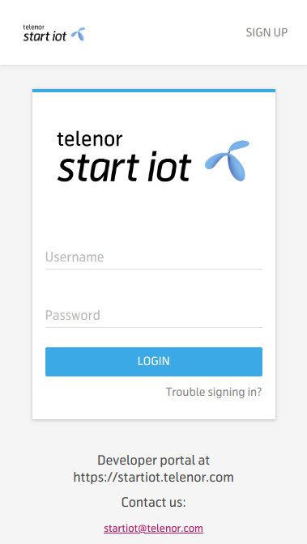
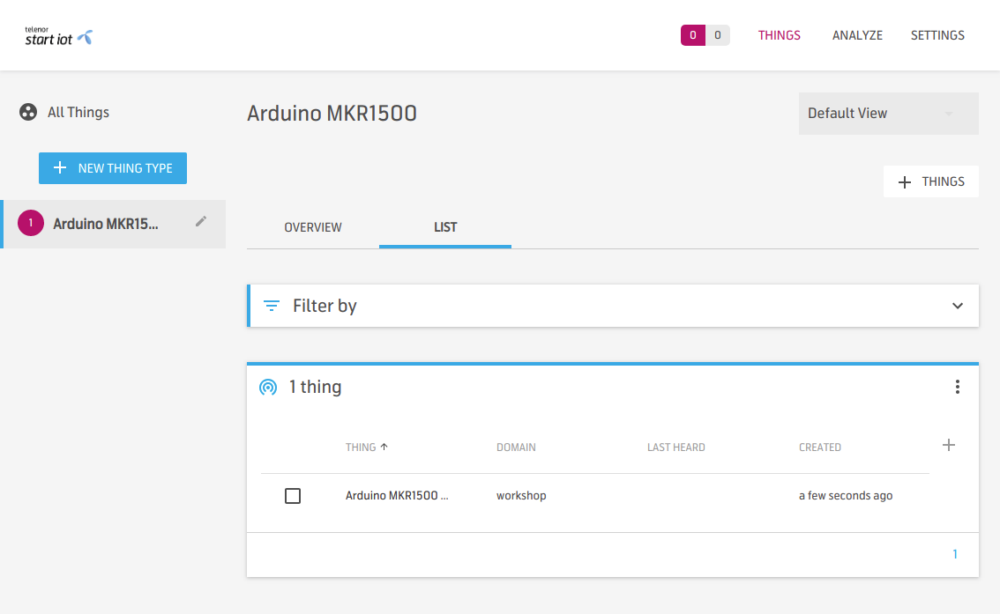
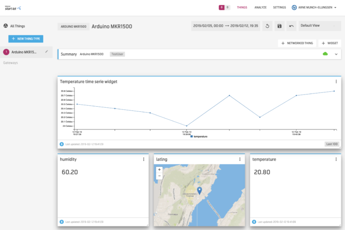

# Register Your Arduino Dev Kit in Telenor Start IoT Managed IoT Cloud

When you create an IoT device you need to register it in the Managed IoT Cloud (MIC) to be able to receive and visualize data that it sends. In this document you will learn some of the key tasks and concepts in the MIC platform such as:

  * Register a device (called a Thing in MIC)
  * Register a 4G NB-IoT dev kit using the IMSI and IMEI information
  * Creating an uplink transformation to parse data packets sent by the dev kit
  * Creating a dashboard with widgets that visualize the data

### Contents

  1. Sign Up for a MIC Platform Account
  2. Add a New Thing Type
  3. Add a Thing Representing Your Dev Kit
  4. Example Dashboard

## 1. Sign Up for a MIC Platform Account
You will have to register for a MIC account in order to register your dev kit. You can do that here:

[https://startiot.mic.telenorconnexion.com](https://startiot.mic.telenorconnexion.com)

Click on the "Sign Up" button in the upper right corner and follow the instructions in order to sign up.



You should be aware that this is a two phased sign up. It therefore requires that you, in phase one, verify your email. We will send a link to the email you register and you will have to use the link to verify your email address. In phase two, we will manually register your private MIC domain and activate your account. You will then receive a second email stating that your account has been activated. Because of this procedure it may take up to 24 hours before your account is ready to use.

## 2. Add a New Thing Type

You will now have to login to your MIC account when it is ready for use. When logged in you must create a new "Thing Type" for your dev kit. A "Thing Type" is a way to organize multiple "Things" that share similarities such as data packet format.

To add a new "Thing Type" click on the "+NEW THING TYPE" button and give it a name and a description. Assign it to the domain that your user was added to. Finally, in the "Uplink Transform" add the following code:

``` js
return JSON.parse(payload.toString('utf-8'));
```


This code is just one simple example of what the uplink transform can look like. In this case it will transform JSON formatted payloads into a JavaScript object and return it. This will separate each property of the object into its separate "parts". For each "part" a resource in MIC will be created. A resource is an MQTT endpoint.

Do not worry about the details for now, this was just for your information. It is possible to create uplink transformations for payloads formatted in basically any format (hex, binary, text, JSON, etc). The uplink transform is just a snippet of Javascript code that MIC will use when doing transformations on your payload, and is generally used to unpack small payloads into understandable resources.

## 3. Add a Thing Representing Your Dev Kit

The "Thing Type" and "Thing" together is a representation of your dev kit in MIC. It is possible to have more than one thing in a Thing Type and this will make the Things in the Thing Type to behave in the same manner with respect to how payloads from the Things are handled. The handling of the payload is described in your uplink transform.

You should now add a new "Thing" for your dev kit. You must click on the "+THINGS" button to create a new Thing. In the popup form, deselect the "Create batch" slider. You must then add a name, a description and select your domain and choose the protocol "nbiot" for your Thing. When you select nbiot as protocol you will also have to add the IMSI and IMEI number of your dev kit. The IMSI and IMEI was obtained in a previous lesson. The image shows an example of what it should look like.


### See Your Newly Created Thing

You can look at and access your Thing if you click the "List" tab. The image shows an example list of devices reflecting a single dev kit Thing.



## 4. Example Dashboard

If you click on the "Thing name" in the list you will create a dashboard for your thing. The dashboard will be mainly empty until the first payload for your Thing arrives. The dashboard is configurable and you can add widgets that represents values sent from your dev kit (called resources). The image shows a very simple dashboard for the dummy payload sent from your device. It is possible to add more advanced widgets. Play around!


